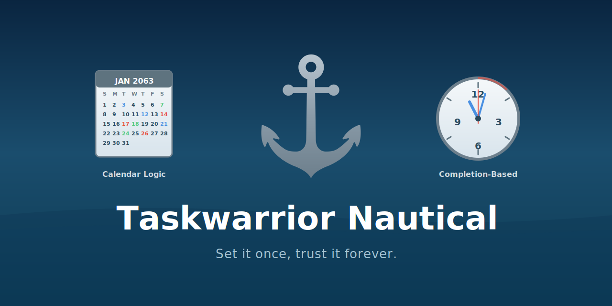

# Taskwarrior-Nautical ⚓︎⛓
**Real-world recurrence for Taskwarrior** - without cloud lock-in or drift.

``` bash
# Last Friday of every month
task add "Monthly review" anchor:"m:last-fri"

# Every 33 h, wall-clock preserved
task add "Take Vitamin" cp:33h due:now+12h

# 2nd Mon + first working day before 15th
task add "Board prep" anchor:"m:2mon,m:15@pbd"
```

<p align="center">
  <a href="https://asciinema.org/a/123456" target="_blank">
  
  </a>
</p>

---

## What & Why

Traditional repeat syntax breaks the moment life gets messy:

- “Every 2nd Monday and 5th Friday”
- “Last working day **of the quarter**”
- “Random weekday every 3 months”
- "Monday at 09:00, Friday at 11:15 and 18:30, Saturday at 15:00"

Nautical gives you a **single line that just works**, keeps your data **local**, and never drifts because it stores **no floating-point time**.

---

## Install (≤ 60 s)

```bash
# 1. Drop the hooks in place
cd ~/.task/hooks
curl -LO https://github.com/catanadj/taskwarrior-nautical/raw/main/on-{add,modify}-nautical.py
chmod +x on-*.py
cd ..
curl -LO https://github.com/catanadj/taskwarrior-nautical/raw/main/nautical_core.py

# 2. Add UDAs (copy/paste block)
curl -s https://raw.githubusercontent.com/catanadj/taskwarrior-nautical/main/uda.conf >> ~/.taskrc

# 3. Optional pretty panels
pip install rich

# 4. Test drive
task add "System test" anchor:"m:2mon" due:today
```

You should see a colour panel showing the next occurrences.
Done - you're ready for the next section.

---

## 30-Second Tutorial

| Pattern you need                                  | One line                             |
| ------------------------------------------------- | ------------------------------------ |
| Last Friday monthly                               | `anchor:"m:last-fri"`                |
| 1st & 15th (nearest weekday)                      | `anchor:"m:1@nw,m:15@nw"`            |
| Every 8 h (exact)                                 | `cp:8h`                              |
| Random weekday in period 20 and last day of month | `anchor:"m:rand@bd + m:20..-1"`      |
| Quarterly on 15-Jan,15-Apr…                       | `anchor:"y:01-15,04-15,07-15,10-15"` |

---

## Anchors (calendar logic)

<details>
<summary>Click for mini-language cheat-sheet</summary>

| Token | Meaning |
|-------|---------|
| `w:mon,wed,fri` | Mon Wed Fri |
| `m:1,15` | 1st & 15th of month |
| `m:last-fri` | last Friday |
| `m:3wed` | 3rd Wednesday |
| `m:1@nw` | 1st, roll to nearest weekday |
| `m:1@pbd` | 1st, roll to **prev** business day |
| `m:1..7@bd` | bucket 1-7, business day only |
| `m:rand` | one random day/month (seeded) |
| `@t=09:00,17:00` | multi-time per day |
| `&` / `,` | AND / OR (parentheses allowed) |

Full grammar & more examples → [Nautical-Manual.pdf](https://github.com/catanadj/taskwarrior-nautical/blob/main/TW-Nautical-Manual.pdf)
</details>

---

## Chains (completion-based)

<details>
<summary>Click for examples</summary>

```bash
# 12 d after completion, keep 09:00 wall clock
task add "mow lawn" cp:12d due:tomorrow+9h

# 33 h exact (drift-free)
task add "meds" cp:33h due:now+12h

# stop after 5th occurrence
task add "calibrate" cp:3d chainMax:5 due:today
```
</details>

---

## Anchor Modes

- **skip** (default) - missed? move on
- **all** - back-fill every missed slot
- **flex** - skip past, anchor future

---

## Panels & Timeline

Every add/completion prints a compact panel:

```
⚓︎ Next anchor  #2  a4bf5egh → 8c31d2ss
Pattern: m:last-fri  SKIP
First due: Fri 2024-06-28 09:00 (in 3 d)
Upcoming: 02 ▸ Fri 2024-07-26 09:00
          03 ▸ Fri 2024-08-30 09:00
Links left: 8 left (cap #10)
```

---

## Performance & Safety

- **≤ 50 ms** on Termux / old phones
- No network, no cloud, 100 % local JSON
- Atomic import - never orphans a task
- DST-safe, leap-second-safe, 64-bit time
- Plain-text backup - grep your rules!

---

## Requirements

- Taskwarrior ≥ 2.6
- Python ≥ 3.9
- `rich` (optional, for colour panels)

---

## Links

| [Full Manual (PDF)](https://github.com/catanadj/taskwarrior-nautical/blob/main/TW-Nautical-Manual.pdf) | [Examples Gallery](https://github.com/catanadj/taskwarrior-nautical/wiki/Pattern-Gallery) | [Report Bug](https://github.com/catanadj/taskwarrior-nautical/issues) |
|---|---|---|

---
## Support

If you find this tool helpful, any support will be greatly apreciated.

You can do so [here](https://buymeacoffee.com/catanadj). Thank you.

---

**Stop thinking about scheduling - start doing.**
⚓︎ *Deus vult.*
