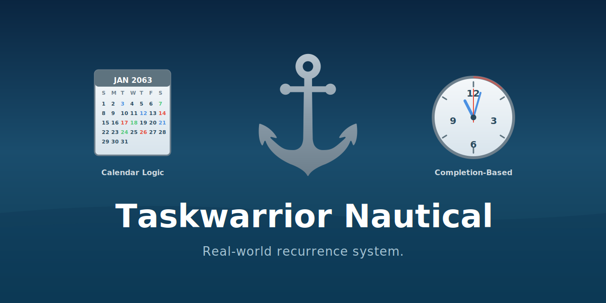

# TaskWarrior Nautical

Taskwarrior is one of the most powerful task databases available. But its built-in recurrence is a weak point  simple repeats, no calendar logic, no omit rules, no real composability. Nautical closes that gap.

It is not a wrapper or a replacement. It is a hook layer that plugs directly into Taskwarrior and gives it a recurrence system as capable as the rest of the tool.

---

## What it does

Nautical intercepts task completions via Taskwarrior hooks and answers one question:

> *When I complete this task, when should the next one happen?*

That answer can be:

- a fixed duration from now (`cp:12d`, `cp:8h`)
- a calendar position like every Monday/Wednesday/Friday (`anchor:"w:mon,wed,fri"`)
- a specific date each year (`anchor:"y:04-12"`)
- a random Saturday each month (`anchor:"m:rand + w:sat"`)
- dates read from a file, such as a CSV of company events
- any combination of the above, minus explicit blackout dates

The spawned task is a normal Taskwarrior task  -  full visibility, full `task` command support, syncs like everything else.

---

## Recurrence engines

### `cp`  -  period chains

Use when the next occurrence is a duration from completion.

```
task add "Mow the lawn"  cp:12d
task add "Take vitamin"  cp:8h
```

Advanced cp where the duration varies depending on the instance:
```
task add "Check on the insect lifecycle"  cp:4d,10d,7d,20d,3d
task add "Inspect field trap"             cp:"rand(3d..7d)"
task add "Routine with jitter"            cp:"14d~2d"
```

Periods under 24 hours use exact completion time. Day-based periods preserve wall-clock routine.
Random `cp` ranges and jitter shorthand are bounded and deterministic per link, so retries and sync stay predictable.

### `anchor`  -  calendar positions

Use when recurrence is about *when on the calendar*, not *how long since last time*.

```
task add "Workout"      anchor:"w:mon,wed,fri"
task add "Date night"   anchor:"m:rand + w:sat"
task add "Anniversary"  anchor:"y:04-12"
```

Anchors compose with `+` (intersection) and `|` (union):

| Expression | Meaning |
|---|---|
| `w:mon,wed,fri` | Mondays, Wednesdays, Fridays |
| `m:1` | First day of each month |
| `m:rand + w:sat` | A random Saturday in the month |
| `y:04-12` | April 12 every year |
| `w:tue,fri \| y:05-05` | Tuesdays, Fridays, or May 5 |

Both engines can combine with all other Nautical features: omit rules, file-backed dates, chain limits, and visibility options.

---

## The anchor model

For anchors, Nautical resolves occurrences as:

```
(anchor ∪ anchor_file) − (omit ∪ omit_file)
```

Inclusion and exclusion are kept separate. Schedules and blackout dates usually come from different sources  -  this matches that reality, and makes the system easier to validate and debug.

---

## Omitting dates

Skip specific dates without rolling forward or backward. Nautical continues searching until it finds the next valid slot.

```
# Skip Wednesdays from the M/W/F workout anchor in April
task add "Workout" anchor:"w:mon,wed,fri" omit:"w:wed + y:apr"

# Skip a holiday window
task add "Workout" anchor:"w:mon,wed,fri" omit:"y:12-24..12-31"

# Use a file of blackout dates
task add "Date night" anchor:"m:rand + w:sat" omit_file:"2026.csv"
```

Omitted slots stay visible in completion timelines as skipped rows, so you can see what was bypassed.

---

## File-backed dates

Pull recurrence sources from external files  -  useful for events driven by a calendar outside Taskwarrior.

Configure a trusted directory:

```
anchor_file_dir = "/home/user/.task/nautical_anchors"
```

Then reference a file:

```
task add "Company event prep" anchor_file:"2026.csv@-1d@t=12:00,18:00"
```

- `@-1d` schedules one day before each date in the file
- `@t=12:00,18:00` creates two occurrences per resulting date

`anchor` and `anchor_file` work together  -  their dates are unioned:

```
task add "Hybrid schedule" \
  anchor:"w:tue,fri | y:05-05" \
  anchor_file:"2026.csv@-1d@t=12:00,18:00"
```

`omit_file` works the same way for exclusions.

---

## Chain limits

Stop a recurrence after a count or a date:

```
task add "Short experiment" cp:1d chainMax:3 due:today
task add "Anniversary prep" anchor:"y:04-12" chainUntil:2028-04-12 due:today+10h
```

---

## Sync and duplicate protection

Nautical is designed for synced setups. It uses chain identity, stable child behavior, and equivalent-child checks to prevent duplicate next tasks from appearing across devices.

The completion rule is explicit: **the completed task state is the source.** There is no hidden template that overwrites the next task. If you annotate or adjust a task before completing it, those changes carry forward. If another device adds an annotation after completion has already happened on a different device, that change cannot reach a child that was already spawned. Sync order still matters  -  but the behavior is predictable.

---

## Batch completion and lock safety

Taskwarrior holds its own locks while hooks run. Nautical avoids contention by recording spawn intents during `on-modify` and draining them during `on-exit`, after Taskwarrior releases its lock. On interactive terminals it can show a progress bar during the drain.

---

## Visibility

Nautical explains what it is doing. Depending on display settings, add and completion output can include:

- the next spawned task
- the recurrence pattern
- natural-language explanation
- omit rules in effect
- file-backed sources
- a timeline of nearby, skipped, and omitted slots
- chain-ending information
- full diagnostics with `NAUTICAL_DIAG=1`

The timeline is especially useful for anchor-based tasks where seeing the surrounding slots  -  including what was skipped  -  matters.

---

## Compared with the Taskwarrior recurrence RFC

The [Taskwarrior recurrence RFC](https://djmitche.github.io/taskwarrior/rfcs/recurrence.html) proposes a native recurrence model with templates, generated instances, instance indexes, and `rtype` values like `periodic` and `chained`. That would be a genuine improvement to Taskwarrior itself.

Nautical goes further in a different direction: calendar expressions, file-backed date sources, explicit omit rules, timelines, batch-safe deferred spawning, and duplicate protection for synced setups. 

---

## Is Nautical for you?

Nautical is overkill if you need a simple daily or weekly repeat. Taskwarrior's native recurrence handles that fine.

It is for people who treat Taskwarrior as a serious task database and want a recurrence engine with the same depth  -  one that handles calendar logic, external schedules, blackout windows, sync safety, and composable expressions, all while keeping generated tasks as normal `task` entries.

The only known hard limitation: Nautical will not spawn tasks dated after `9999-12-31`, so long-term planning has limits. :)

---

## Installation and configuration

Quick install:

```bash
# 1. Drop the hooks in place
cd ~/.task/hooks
curl -LO https://github.com/catanadj/taskwarrior-nautical/raw/main/on-{add,modify,exit}-nautical.py
chmod +x on-*.py

# 2. Install the shared Nautical package next to your Taskwarrior data
cd ..
curl -L https://github.com/catanadj/taskwarrior-nautical/archive/refs/heads/main.tar.gz \
  | tar -xz --strip-components=1 taskwarrior-nautical-main/nautical_core

# 3. Add UDAs
curl -s https://raw.githubusercontent.com/catanadj/taskwarrior-nautical/main/uda.conf >> ~/.taskrc

# 4. Optional pretty panels
pip install rich

# 5. Test
task add "System test" anchor:"m:4mon"
```

See the [manual](./TW-Nautical-Manual.pdf) for full UDA setup, configuration options, hook installation, and annotated examples.

---

## Feedback

Feedback from Taskwarrior users is especially welcome around:

- recurrence edge cases the syntax does not cover well
- sync behavior with real multi-device setups
- whether the expression syntax feels natural in actual workflows

Open an issue or start a discussion in the repository.


## Documentation

- [PDF Manual](./TW-Nautical-Manual.pdf)
- [Releases](https://github.com/catanadj/taskwarrior-nautical/releases)
- [Issues](https://github.com/catanadj/taskwarrior-nautical/issues)

## Support

If Nautical is useful to you, support is appreciated:

[Buy me a coffee](https://buymeacoffee.com/catanadj)
