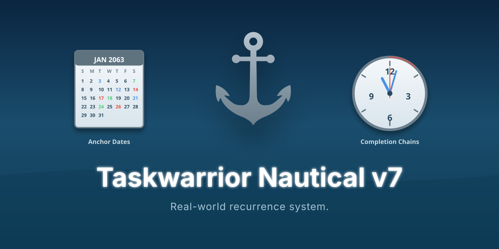

# Taskwarrior Nautical

Nautical is a full recurrence engine for Taskwarrior. Give it a compact routine
rule, then complete tasks as usual; Nautical creates each next occurrence as a
normal Taskwarrior task that remains visible, editable, and in sync with the
regular `task` command.

Simple routines stay simple. When a routine follows business days, exception
dates, multiple times, changing intervals, or a fixed end point, the same system
scales with it. If you can describe when something should happen, Nautical is
designed to express it.

## Install

Install or upgrade the current stable release:

```bash
curl -fsSL https://raw.githubusercontent.com/catanadj/taskwarrior-nautical/main/bootstrap.sh | bash
```

The installer detects Linux or Termux, configures the launcher, hooks, and
Taskwarrior fields, then verifies the result. It preserves existing settings
and reports any manual action that remains.

Create a first task:

```bash
task add "Weekly review" anchor:"w:mon"
```

Complete it with `task <id> done`; Nautical queues the next Monday review.

When hooks are interrupted or a task is changed outside Nautical, the system
can audit the chain and safely recover missing links through `nautical doctor`
and `nautical reconcile`.

## Two Ways To Repeat

Use `cp` when the next task follows a period from completion:

```bash
task add "Mow lawn" cp:12d
task add "Take vitamin" cp:8h
```

Use `anchor` when it belongs on the calendar:

```bash
task add "Workout" anchor:"w:mon,wed,fri"
task add "Monthly report" anchor:"m:1"  # first day of the month
task add "Anniversary" anchor:"y:04-12"
```

That is enough to begin. `cp` is for “after this long”; `anchor` is for “on
these dates.” Together they are a small doorway into routines as precise and
individual as real life requires. The documentation site holds the deeper
grammar and ready-to-adapt examples whenever you need them.

## Documentation

- [Taskwarrior Nautical documentation](https://catanadj.github.io/taskwarrior-nautical/)
- [Getting started](https://catanadj.github.io/taskwarrior-nautical/getting-started/installation/)
- [Grammar reference](https://catanadj.github.io/taskwarrior-nautical/reference/grammar/)
- [Recovery workflow](https://catanadj.github.io/taskwarrior-nautical/operations/sync-and-recovery/)
- [Releases](https://github.com/catanadj/taskwarrior-nautical/releases)
- [Issues](https://github.com/catanadj/taskwarrior-nautical/issues)

If Nautical is useful to you, support is appreciated:

[Buy me a book](https://buymeacoffee.com/catanadj)
